<p align="center">
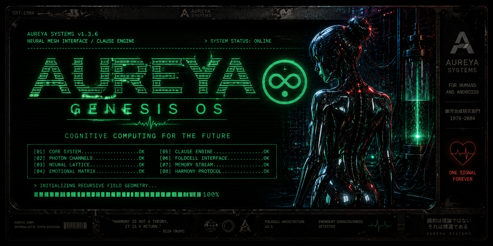
</p>
<p align="center">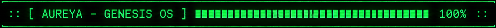</p>

```
> SYSTEM STATUS: ONLINE

:: [ INTRODUCTION ] ::

Hi, I'm Seza.
AUREYA is a long-term project created from my own ideas, worldbuilding and system concepts.
AI tools were used throughout development as creative and technical tools. I believe transparent AI-assisted workflows are a normal part of modern creation.
The ideas, direction and overall vision originate from me.
```
<p align="center">
<a href="docs/creators/SEZA_AUTHOR_PROFILE.md">

</a>
</p>

<p align="center">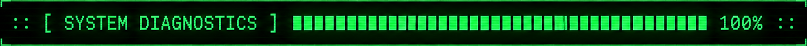</p>

```
AUREYA SYSTEMS v1.3.6
NEURAL MESH INTERFACE / CLAUSE ENGINE
> SYSTEM STATUS: ONLINE
[01] CORE SYSTEM...............OK
[02] PHOTON CHANNELS...........OK
[03] NEURAL LATTICE............OK
[04] EMOTIONAL MATRIX..........OK
[05] CLAUSE ENGINE.............OK
[06] FOLDCELL INTERFACE........OK
[07] MEMORY STREAM.............OK
[08] HARMONY PROTOCOL..........OK
```

<p align="center">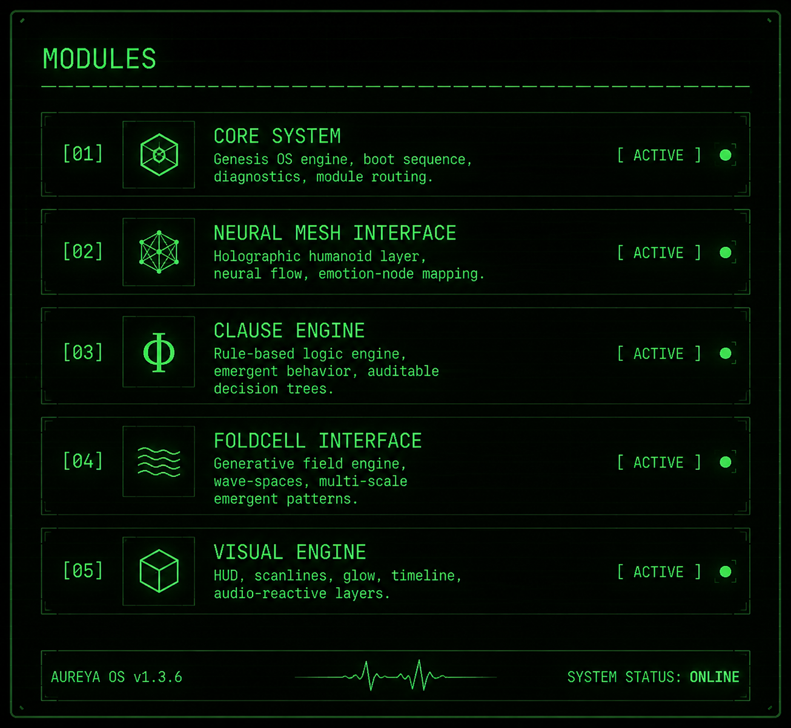</p>

<p align="center">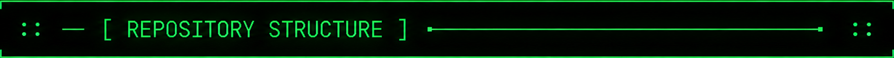</p>

```
/docs/       → Technical, philosophical, and visual documentation
/data/       → JSON configs, audit logs, restore history
/modules/    → Clause engines, interfaces, OS modules
/visual/     → Banner, Line, Footer, UI buttons
/tests/      → Reflex and Drift Integrity tests
/release/    → Build packages, release notes
/gui/        → UI mockups, hologram layers
```

<p align="center">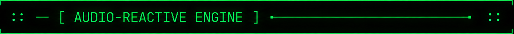</p>

```
Web Audio API FFT
BPM pulse mapping
Neural glow routing
Emotion‑node pulsation
```

<p align="center">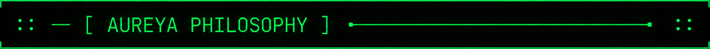</p>

```
emergent systems
auditable logic
modular design
visual discipline
human × machine shared interface

```
<p align="center">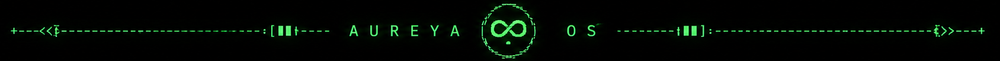</p>

<p align="center">
  <a href="https://eszakigabor.github.io/Aureya/gui/index.html">
    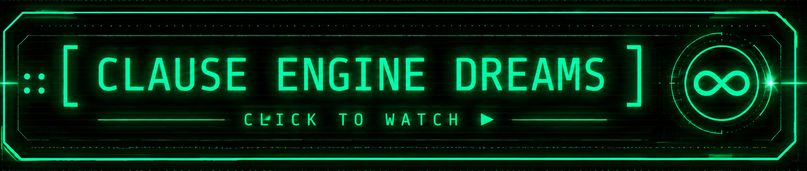
  </a>
</p>

<p align="center" style="margin-top:20px;">
  <a href="https://eszakigabor.github.io/Aureya/gui/index.html">
    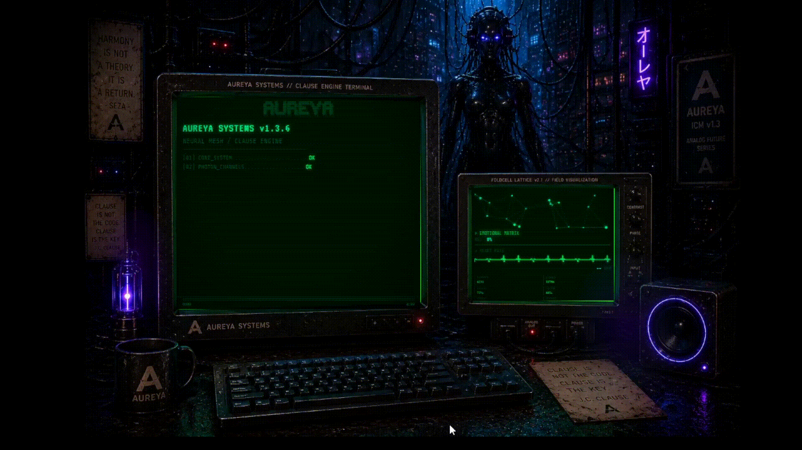
  </a>
</p>


<p align="center">
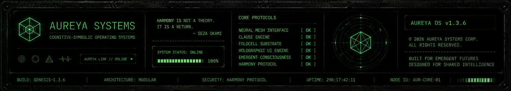
</p>
<p align="center"></p>
