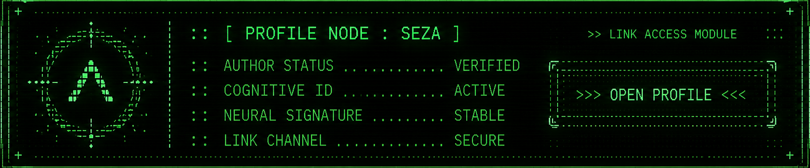

<p align="center">

</p>
<p align="center"></p>

```
> SYSTEM STATUS: ONLINE

:: [ INTRODUCTION ] ::

Hi, I'm Seza.
AUREYA is a long-term project created from my own ideas, worldbuilding and system concepts.
AI tools were used throughout development as creative and technical tools. I believe transparent AI-assisted workflows are a normal part of modern creation.
The ideas, direction and overall vision originate from me.
```
<p align="center">
<a href="docs/creators/SEZA_AUTHOR_PROFILE.md">

</a>
</p>

<p align="center"></p>

```
> AUREYA IDENTIFICATION:
Classification:
Cognitive–Symbolic System Universe
Function:
Worldbuilding / Systems / Interfaces
Status:
ASSEMBLY IN PROGRESS
Purpose:
Building a modular human × machine ecosystem
```

<p align="center"></p>

<p align="center"></p>

```
> REPOSITORY STRUCTURE DETECTED

Scanning primary archive sectors...

[01] /docs/ ............. documentation / research / philosophy
[02] /data/ ............. configs / logs / restore history
[03] /modules/ .......... engines / interfaces / system layers
[04] /gui/ .............. holographic interface assets
[05] /tests/ ............ diagnostics / integrity scans
[06] /release/ .......... build packages / release data
[07] /visual/ ........... banners / panels / UI elements

STATUS: STRUCTURE VERIFIED
```

<p align="center"></p>

```
> AUDIO REACTIVE ENGINE DETECTED

[01] Web Audio API FFT
[02] BPM pulse mapping
[03] Neural glow routing
[04] Emotion-node pulsation

STATUS: ACTIVE
```

<p align="center"></p>

```
> PHILOSOPHY MATRIX LOADED

[01] emergent systems
[02] auditable logic
[03] modular design
[04] visual discipline
[05] human × machine shared interface

STATUS: STABLE

```
<p align="center"></p>

<p align="center">
  <a href="https://eszakigabor.github.io/Aureya/gui/index.html">
    
  </a>
</p>

<p align="center" style="margin-top:20px;">
  <a href="https://eszakigabor.github.io/Aureya/gui/index.html">
    
  </a>
</p>


<p align="center">

</p>
<p align="center"></p>
