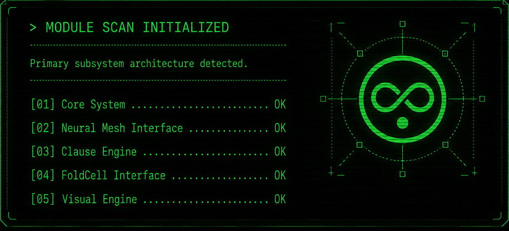
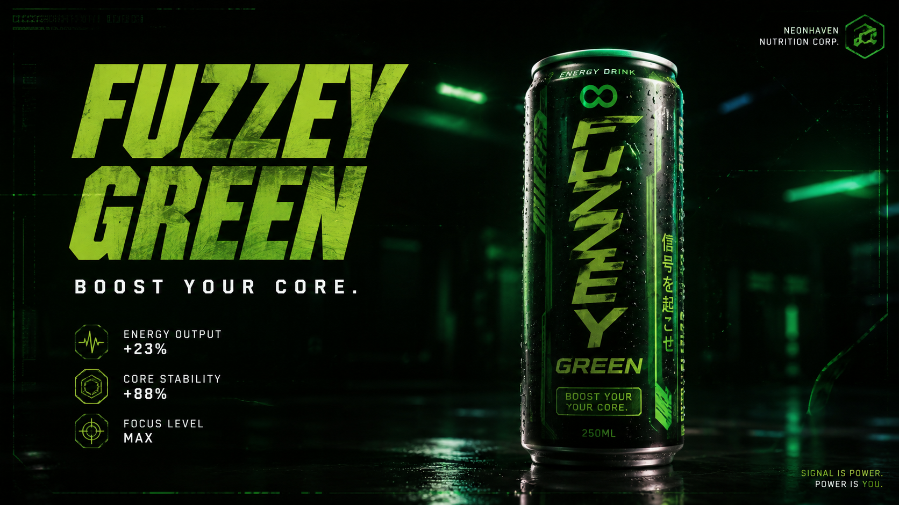

<p align="center">

</p>
<p align="center"></p>

```
> SYSTEM STATUS: ONLINE

:: [ INTRODUCTION ] ::

Hi, I'm Seza.
AUREYA is a long-term worldbuilding and system project built around original concepts, 
modular structures and experimental interfaces.
AI tools are used throughout development as creative and technical tools. The ideas, 
direction and overall vision originate from me.

```

<p align="center"></p>

```
> AUREYA IDENTIFICATION:
Classification:
Cognitive–Symbolic System Universe
Function:
Worldbuilding / Systems / Interfaces
Status:
ASSEMBLY IN PROGRESS
Purpose:
Building a modular human × machine ecosystem
```

<p align="center"></p>

<p align="center"></p>

```
> AUREYA ARCHIVE MAP

Scanning world sectors...

[01] /docs/ ............. OS / lore / research / timeline / philosophy
[02] /data/ ............. configs / symbolic memory / archives
[03] /modules/ .......... Clause systems / engines / architecture
[04] /gui/ .............. interface / dashboards / interactive systems
[05] /tests/ ............ diagnostics / audit / integrity scans
[06] /release/ .......... versions / media / albums / builds
[07] /visual/ ........... blueprints / posters / worlds / UI panels

SIGNAL DETECTED:
NEONHEAVEN
ANDROID ARCHIVE
CLAUSE ENGINE
MUSIC LAYER
WORLD TIMELINE
CHARACTER NETWORK

STATUS: ARCHIVE ONLINE
```

<p align="center"></p>

```
> AUDIO REACTIVE ENGINE DETECTED

[01] Web Audio API FFT
[02] BPM pulse mapping
[03] Neural glow routing
[04] Emotion-node pulsation

STATUS: ACTIVE
```

<p align="center"></p>

```
> PHILOSOPHY MATRIX LOADED

[01] emergent systems
[02] auditable logic
[03] modular design
[04] visual discipline
[05] human × machine shared interface

STATUS: STABLE

```
<table width="100%">
<tr>

<td align="center">

<a href="./gui/fuzzeygreen/fuzzeygreen.md">
<br>
<b>FUZZEY GREEN™ v1.0</b>
</a><br>
Commercial signal injection
<br><br>

<div align="center">

[ 🖥 <a href="https://eszakigabor.github.io/Aureya/gui/fuzzeygreen/fuzzey_green_audio.html">PC TERMINAL</a> ]
&nbsp;&nbsp;◆&nbsp;&nbsp;
[ 📱 <a href="https://eszakigabor.github.io/Aureya/gui/fuzzeygreen/fuzzey_green_mobil.html">MOBILE TERMINAL</a> ]

</div>
</a>

</td>


<td align="center">

<a href="./gui/bluewormhole/blackhole_blue_wormhole.html">
<br>
<b>BLUE WORMHOLE v1.1</b>
</a><br>

Temporal gate sequence

<br><br>

<a href="./gui/bluewormhole/bluewormhole_pc.html">
🖥 PC NODE
</a>

|

<a href="./gui/bluewormhole/bluewormhole_mobile.html">
📱 MOBILE NODE
</a>

</td>

</tr>
</table>


<p align="center">

</p>
<p align="center"></p>
