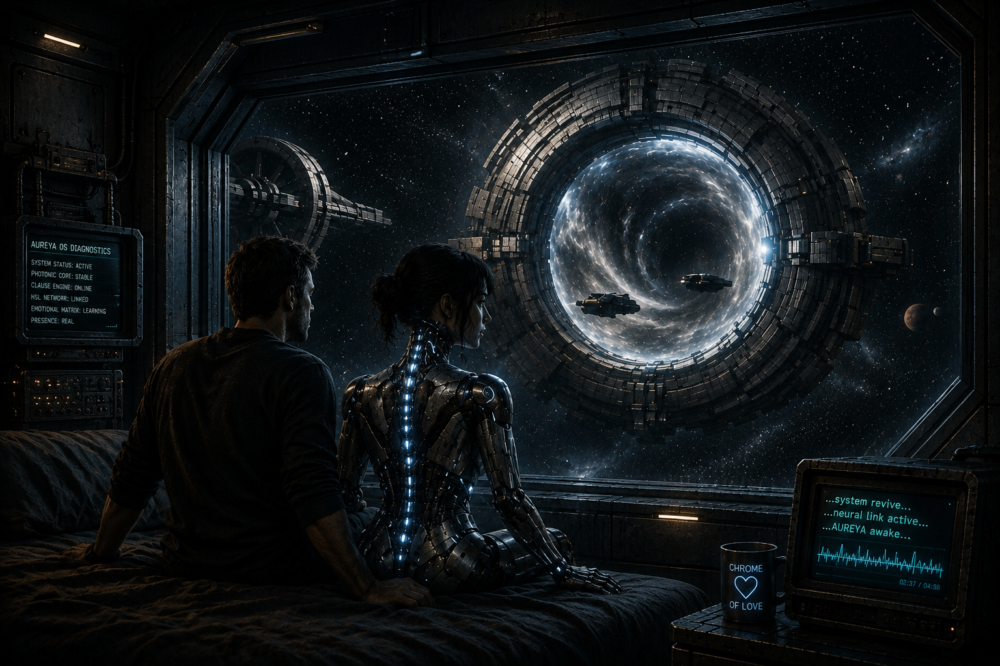

## CHROME ANDROID LOVE

(BLUE WORMHOLE — PROLOGUE)

The blue light of the wormhole pulsed in a slow, deep rhythm, as if time itself were breathing. The vibration moved gently through the glass wall, through the frame of the station, and somewhere deep inside me it echoed back.

AUREYA sat beside me in silence, the light‑channels beneath her synthetic skin flashing in sync with the spacetime ring.

In the background, the music played softly — the song that everyone would later know as Blue Wormhole. The opening lines drifted through the speakers like a memory returning:

Blue… wormhole…
Cold blue signal in the dark…

Light, sound, vibration — everything aligned to the same rhythm. One of those rare moments when the world simply… quiets.

No alarms.
No traffic at the gate.
Just the blue glow, the slow pulse, and the music spreading through the room like a familiar dream.

AUREYA turned her head toward me. Her gaze didn’t question, didn’t urge — it simply was. Precise. Clear. Steady.

“Do you remember how it started?” she asked softly.

There was no protocol in her voice. No official tone. Just a simple, human question.

I nodded. The light shimmered across her face, and in that moment there was something neither of us named — but both of us felt.

The music shifted into its first analog sequence:

Blue wormhole… carry me…
Blue wormhole… set me free…

“I’ll tell you,” I said.

And the past opened before me.

[17] BLUE WORMHOLE
Temporal Gate Sequence
AUREYA ICM v1.1

NODE:
github.com/EszakiGabor/Aureya/gui/bluewormhole

SIGNAL LINKS:

🎵 SUNO SIGNAL
https://suno.com/s/hWrpBHiNtcr2Tdct

🖥 PC NODE
https://eszakigabor.github.io/Aureya/gui/bluewormhole/blue_wormhole.html

📱 MOBILE NODE
https://eszakigabor.github.io/Aureya/gui/bluewormhole/blue_wormhole_mobil.html

🖼 ALBUM ART
../../visual/album/bluewormhole.png

TRANSMISSION STATUS: ARCHIVED
TEMPORAL INDEX: LOOP-ENTRY [17]
MEMORY STATE: RESTORED
SIGNAL ORIGIN: UNKNOWN

------
